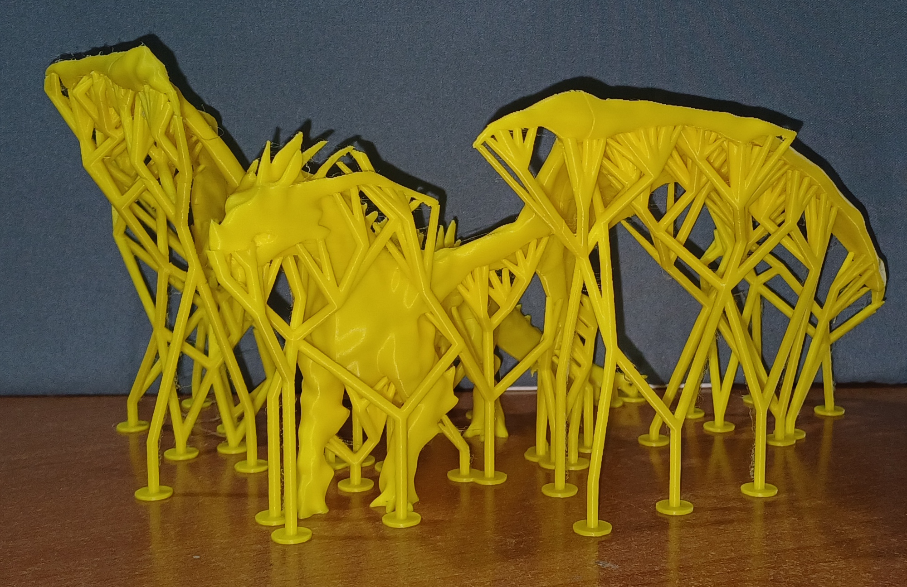
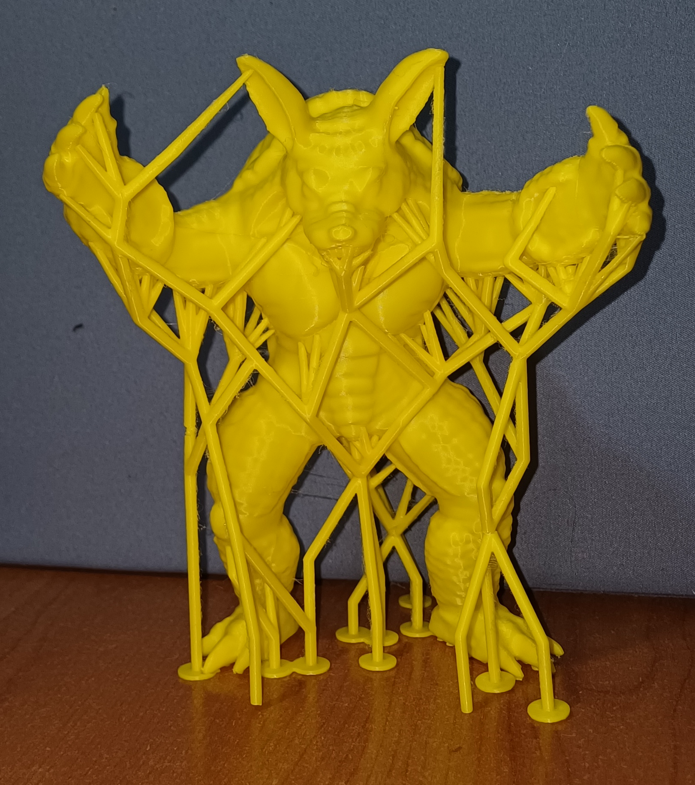
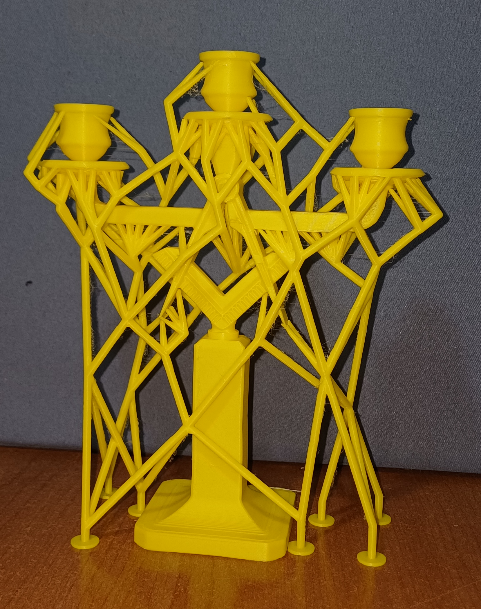

# EvoStrut

EvoStruct is my master degrees thesis.
It consist in a genetic-algorithm-based optimizer that try 
A genetic-based support structure optimization algorithm for additive manufacturing.

The algorithm is designed with FDM 3D printers in mind, and have a novel
stiffness evaluation teqnique that allow to apply a cost for supports that are not 
stiff enough (and therefore not printable)

## Print test and performance

In our testcases we have achieved an average of 43% reduction in 
the material required for the support compared to OrcaSlicer's "Tree Supports".

Here you can see a few picture of the supports that were generated:

## Algorithm description

A full description on how the algorithm works can be found in 
the latex report inside the [report](./report/) directory.

## Test outputs

All the tests that I have conducted have the output and loss function saved in 
this [archive](https://drive.google.com/file/d/1NylpWJB9UgmBFch2XTF3DMP0tPjwqmdj/view?usp=sharing). Te archive also include some charts that show the loss 
function trends, that were not included in the thesis as they were too many.
(note that the file is shared using google drive rather than git, as it was too large)

## Installations

Installation is simple, as everything can be compiled with rust, without 
andy mandatory external dependency,
there is only one optional dependency for visualization, namely "Rerun"

### Rerun
All the visualizations for this project are handled with `rerun`.
The rust package is installed automatically with cargo, but the viewer
need to be installed manually.
Check out [the instructions](https://rerun.io/docs/overview/installing-rerun/viewer)
